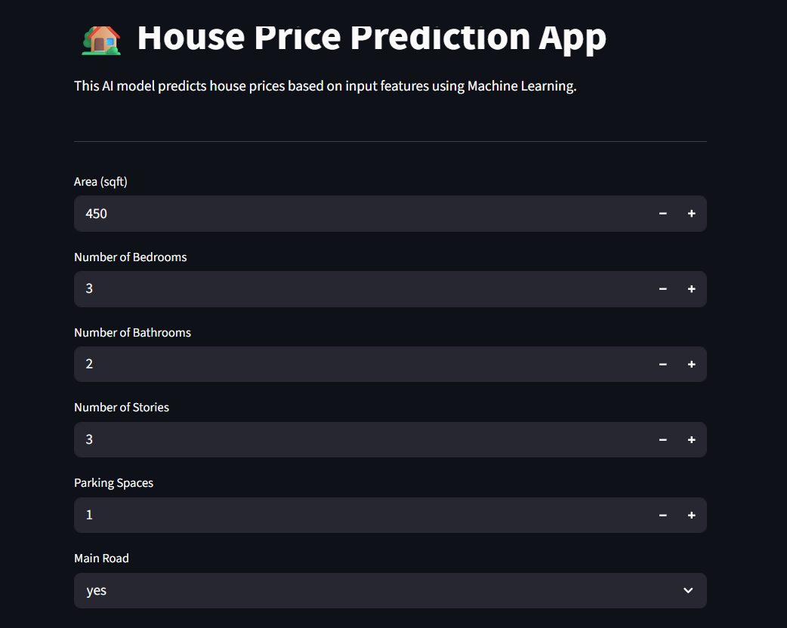
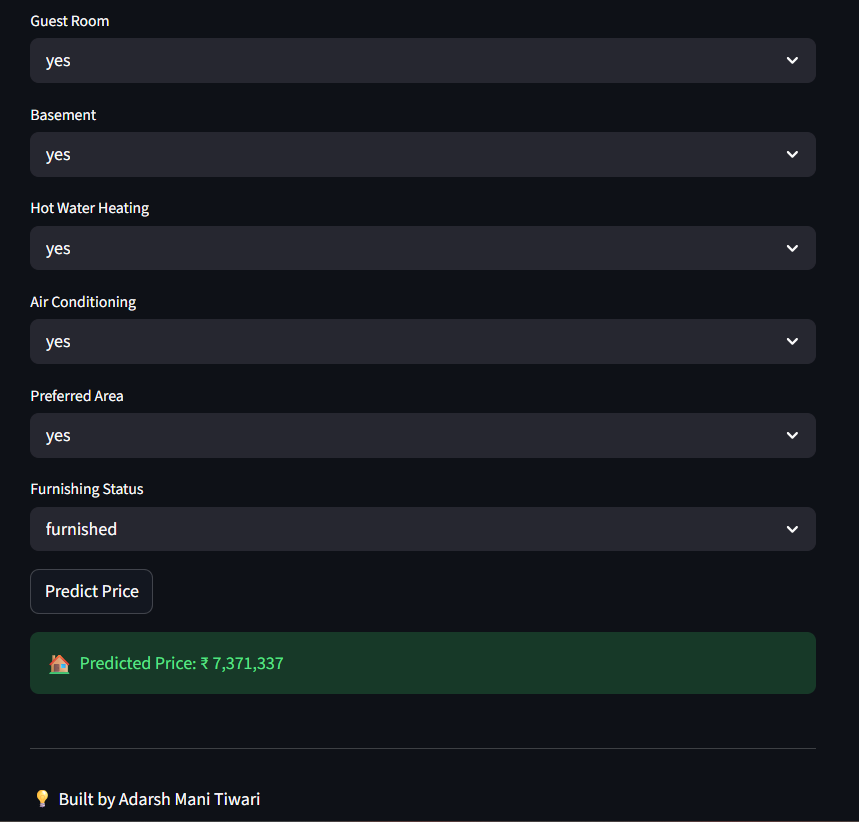

# 🏡 House Price Prediction App

This is an end-to-end Machine Learning project that predicts house prices based on features such as area, number of rooms, and various amenities.

The model is deployed using **Streamlit**, allowing users to interactively input values and get real-time predictions.

---

## 🚀 Features
- Predict house prices using Machine Learning
- Real-time predictions through Streamlit UI
- Handles categorical and numerical data
- Clean and interactive interface

---

## 🧠 Technologies Used
- Python
- Pandas, NumPy
- Scikit-learn
- Streamlit

---

## 📊 Machine Learning Workflow
1. Data preprocessing (handling categorical variables)
2. Feature engineering
3. Model training (Linear Regression & SGD)
4. Hyperparameter tuning
5. Model evaluation (R² score ≈ 0.65)
6. Deployment using Streamlit

---

## 🖥️ How to Run Locally

```bash
pip install pandas numpy scikit-learn streamlit
streamlit run app.py
```
## 📸 App Preview






